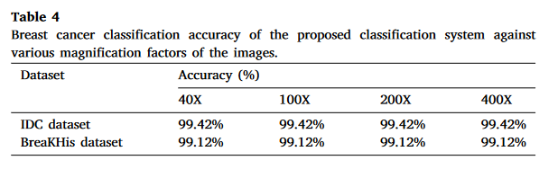

# Classifying Breast Histopathology Images with Transfer Learning

This project began as a personal challenge. In my final year as a biomedical engineering undergraduate, I took a Coursera course on neural networks. (in hindsight, not the best idea considering I was also taking a full load of classes.)
At the time, I was also trying to figure out what I wanted to do after graduation. I had found the convolutional neural network and image classification sections of the course pretty interesting, so I decided to put it to the test in a biological context.
I was primarily inspired by some results that I stumbled across while researching image classification applications in the biomedical field[^1].  

I found these results a bit hard to believe - especially since the IDC dataset consists of only 40X magnification images that are 50 x 50 pixels in dimension.
So I decided to try to replicate these results, just for fun.  

Working over winter break, I created a rough project comparing transfer learning models that used common image classifier architectures as bases. Unfortunately, I became far too busy to expand on the project and forgot about it. 
I only seriously started to look at the classifiers I had trained several months after graduation - when I started to consider applying to graduate school.  

By then, two things had changed.
1. After some frustrations on another project, I switched from Tensorflow to Pytorch. As a result, I had somewhat forgotten Tensorflow syntax and wasn't too eager to relearn it for this project. 
2. My hardware has been updated. I had previously used my Macbook to train these models. With no dedicated GPU, I had limited to simple architectures, smaller datasets, and fewer training epochs.

And here is the final result! A lot of things changed between the start and end of the project, but I'm glad I can finally put it to rest. 
There are still some limitations to this project, and it shouldn't be taken too seriously. In particular, only the BreakHis dataset was used, so the resultant models are not comparable to those in the inspiration paper.  

The training and analysis processes can be found in the respective Jupyter Source Files, and tensorboard can be used to see the model training metrics found in the summary_writers folder. For better visualization, graphics for accuracy, precision, recall, and f1 score are available in the validation_graphs folder. 

Due to file restraints, only the classifier layers from the best models of each architecture were uploaded to Github. They can be found in the trained_models folder.

[^1]: https://linkinghub.elsevier.com/retrieve/pii/S2772442523000746